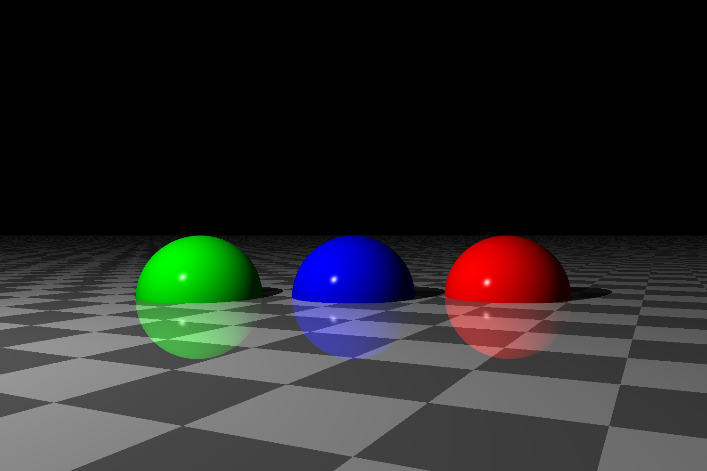
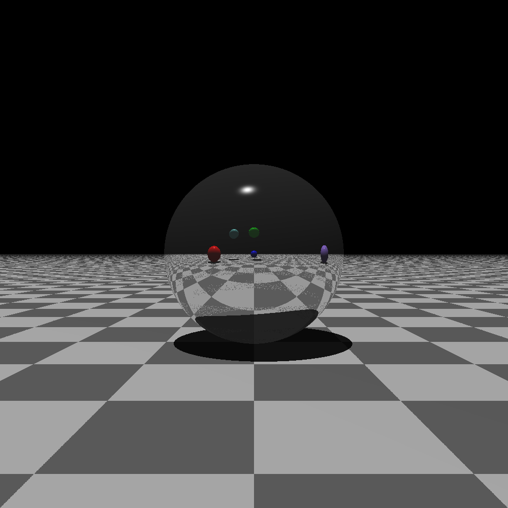
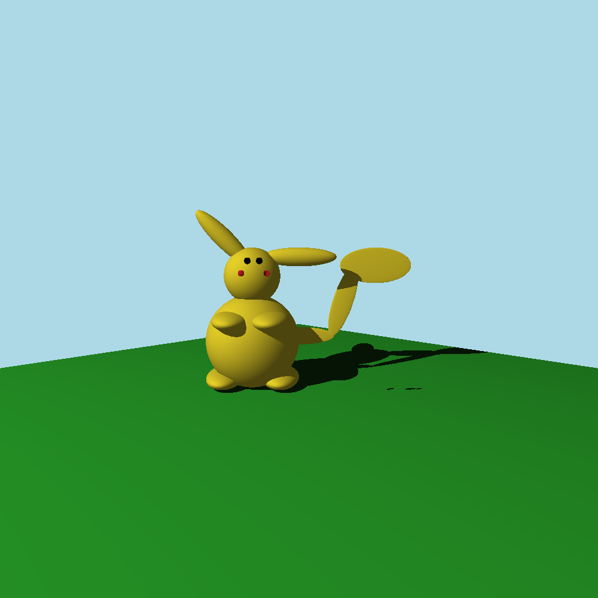
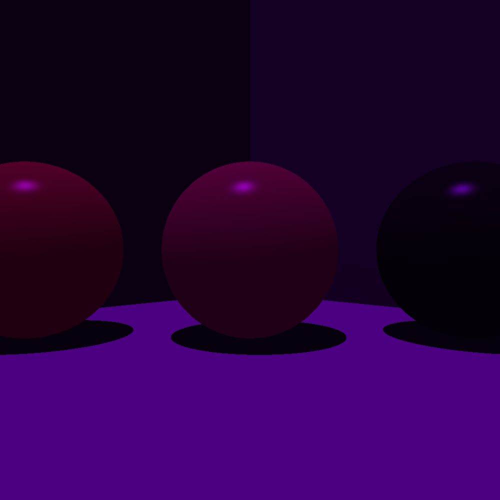

# **Ray Tracer**

## **Repository to track Ray Tracer development and results**



### **Developed by:**
+ [Kenneth Daniel Villalobos Solís](https://github.com/kdaniel1652)
+ [Luis David Solano Santamaría](https://github.com/GoninDS)

### **Project description**

This repository is used to track development and show results of the ray tracer developed based on the **'The Ray Tracer Challenge'** book by Jamis Buck. This project was started during a Graphing and Visualization course and it was developed utilizing **Test Driven Development** in mind.

The contents of the project contain an implementation of chapters 1 through 13 allowing to create scenes that include:

+ Shadows
+ Materials
+ Reflection
+ Refraction
+ Spheres
+ Planes
+ Cubes
+ Cylinders 
+ Patterns

### **Usage manual**

#### **Environment configuration**

For the correct execution of the project, you will need to install the Python module `abcplus`. This module allows the use of **abstract classes** for certain features such as patterns and shapes.

To do so you can execute the following **command** in the terminal:

```
  pip install abcplus
```

Once you have done this, you need to generate a `Python egg package`, to do so execute in the `src` folder the following terminal **command**:

```
  pip install -e .
```

This will generate the egg package allowing the correct execution of the project.

#### **Ray Tracer execution**

For the execution of the project, once the environment has been configured, you will need to create a main file inside the src folder which will contain the scene that you want rendered.

Once this main file is created you can execute the ray tracer by doing:

```
  python [file_name.py]
```

Where `[file_name.py]` corresponds to the main file you created.

You can find several examples on how to set up a scene in the [main_tracer.py](./src/main_tracer.py) file.

Once an image is produced, it will be done so in the `PPM format`. To obtain it in another format like `PNG` use a convertion tool.

#### **Unit tests execution**

For the execution of the unit tests, inside the `src directory` execute the following terminal **command**:

```
  python -m pytest .\tests
```

### **Image gallery**

In here you will find some of the results that where made with the ray tracer. You can find the rest in the [results directory](./results).

#### **Space canvas**


#### **Reflective spheres**



#### **Pikachu**



#### **Purple light test**



